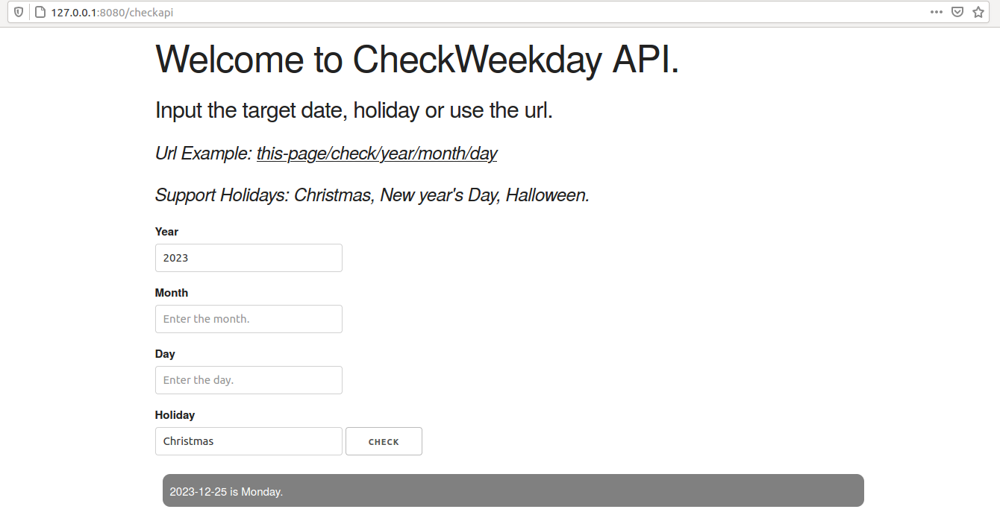
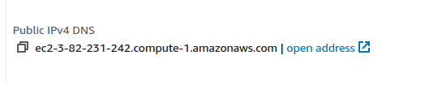

# Project 1: Cloud Continuous Delivery of Microservice

## Brief
In this project, we are supposed to build cloud continuous delivery of Microservice in FlaskAPI. In paritcular, I build a simple Checkweekday FlaskAPI using Python, which checks the exact weekday (e.g., Friday) of an input date (e.g., 2027-10-1) either in the past or in the future. Through this project, I obtain a better understanding of how to deploy a useful Microservice API in the server.

### Key Result: 
* 1) Test the codebase locally.

`python3 app.py`

Usage of examples one: input a specific date via UI

Usage of examples two: input the holiday via UI

Handle invalid inputs:

Url usage of examples: http://127.0.0.1:8080/check/1998/8/22

* 2) Use AWS Cloud9 to deploy the codebase

Usage of examples: http://ec2-3-82-194-31.compute-1.amazonaws.com:8080/check/1998/8/22

Configure the environments:

Configure the domain name:

